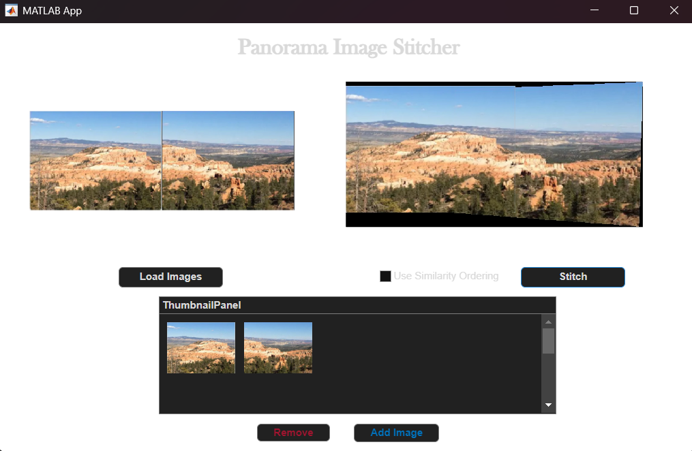
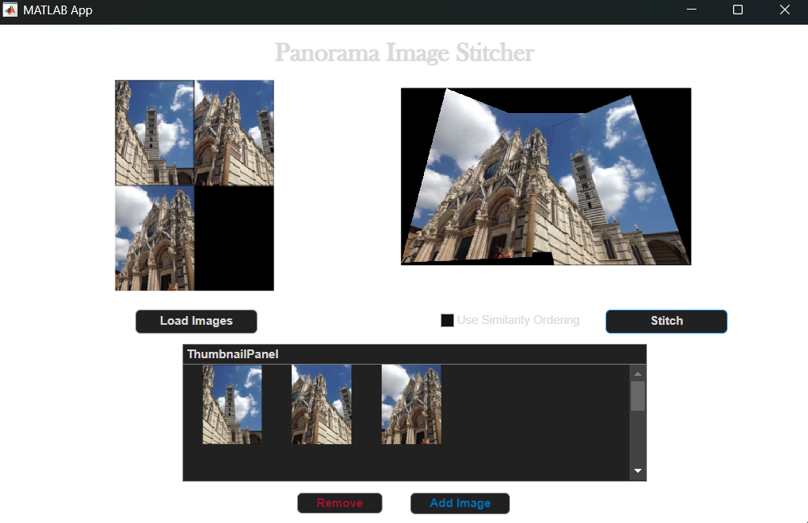
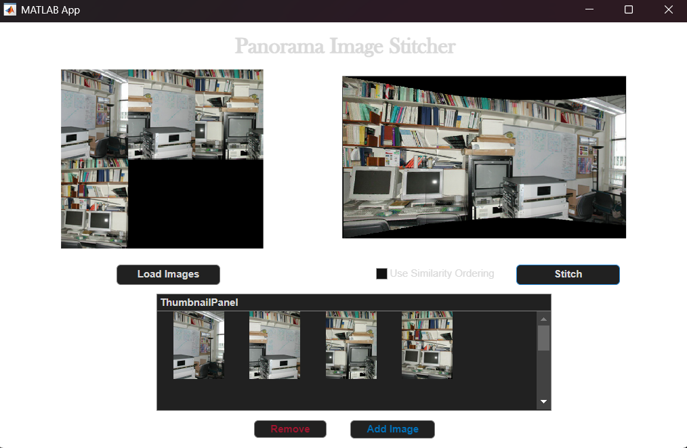

# Panorama Image Stitcher (MATLAB)

A MATLAB App Designer application that performs automatic multi-image panorama stitching using SURF feature detection, RANSAC-based homography estimation, and global reference frame alignment.
This project implements anchor-based global homography estimation to avoid geometric drift and uses feather blending for seamless panorama generation.

## Features

- SURF feature detection
- RANSAC-based homography estimation
- Automatic image ordering (optional)
- Global reference frame alignment
- Feather blending for seamless panoramas
- Interactive GUI for loading, adding, and removing images

---

## How It Works

1. Detect SURF features in all images.
2. Match features between images.
3. Estimate projective transformations using RANSAC.
4. Align all images to a central anchor frame.
5. Warp images into a global coordinate system.
6. Blend overlapping regions using weighted averaging.

---

## Example Results

- Two Input Images:

- Three Input Images:

- Four Input Images:

---

## Requirements

- MATLAB (R2021a or later recommended)
- Computer Vision Toolbox
- Image Processing Toolbox

---

## How to Run

1. Open `PanoramaStitchingFinal.mlapp` in MATLAB. (The accompanying `.m` file is included for reference but not required to run the app.)
2. Click **Load Images**.
3. (Optional) Enable similarity ordering (not recommended, built for experiments).
4. Click **Stitch**.

---

## Future Improvements

- Cylindrical projection to reduce perspective distortion
- Multi-band blending for smoother seams
- Exposure compensation
- Bundle adjustment
